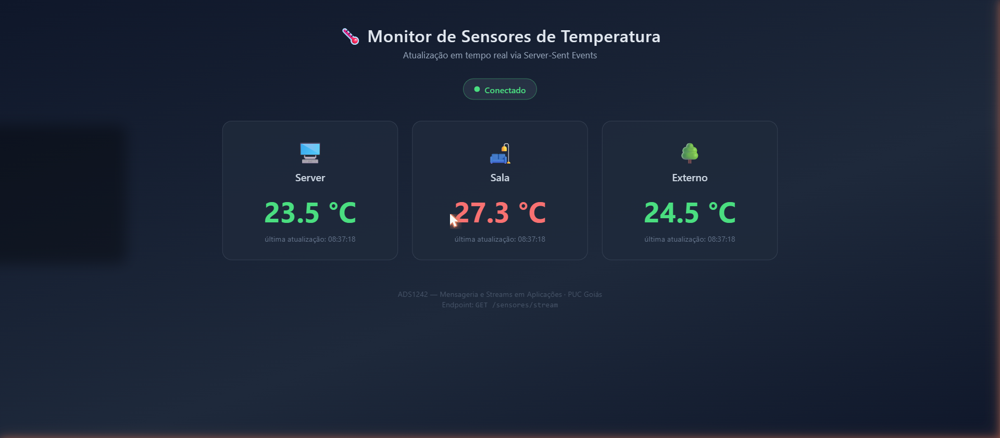

# Atividade SSE — Monitor de Sensores de Temperatura

Aplicação **Spring Boot** que simula leituras de sensores de temperatura e as transmite via **SSE (Server-Sent Events)** para uma página HTML com atualização em tempo real.

> ADS1242 — Mensageria e Streams em Aplicações · PUC Goiás
> Aluno: Rafael Barros

## Tecnologias

| Tecnologia | Versão |
|---|---|
| Java | 21 |
| Spring Boot (spring-boot-starter-web) | 3.5.7 |
| Maven Wrapper | incluído no repositório |
| Front-end | HTML + CSS + JavaScript puro (EventSource API) |

## Como executar

Pré-requisito: **JDK 21** instalado (variável `JAVA_HOME` apontando para ele).

```bash
# Windows
mvnw.cmd spring-boot:run

# Linux / macOS
./mvnw spring-boot:run
```

A aplicação sobe em `http://localhost:8080`.

Abra **http://localhost:8080** no browser: a página `index.html` conecta-se ao stream SSE e exibe os três cards (sala, server e externo) atualizando a cada 2 segundos, além do indicador de estado da conexão (Conectando / Conectado / Reconectando).

## Endpoints

| Método | Rota | Content-Type | Descrição |
|---|---|---|---|
| GET | `/` | `text/html` | Página de monitoramento (front-end com EventSource) |
| GET | `/sensores/stream` | `text/event-stream` | Stream SSE com as leituras dos sensores |

### Formato dos eventos

Cada leitura é publicada como um evento SSE com os campos `id`, `event`, `data` e `retry`:

```
id: 42
event: temperatura
data: {"sensor":"sala","valor":23.5,"timestamp":1718000000000}
retry: 3000
```

- `id` — sequência monotônica; o browser a reenvia no header `Last-Event-ID` ao reconectar, e o servidor faz **replay** dos eventos perdidos (últimos 50 mantidos em memória);
- `event: temperatura` — tipo do evento, consumido no cliente com `addEventListener('temperatura', ...)`;
- `data` — JSON da classe `LeituraTemperatura` (`sensor`, `valor`, `timestamp`);
- `retry: 3000` — intervalo de reconexão automática do browser (3 s).

A cada 20 segundos o servidor também envia um comentário `: heartbeat` para manter a conexão viva atrás de proxies.

Teste rápido via terminal:

```bash
curl -N http://localhost:8080/sensores/stream
```

## Arquitetura

```
src/main/java/br/com/rafaelbarros/sse/
├── AtividadeSseApplication.java   # Main + @EnableScheduling
├── config/
│   └── AsyncConfig.java           # @EnableAsync + ThreadPoolTaskExecutor (core=5, max=20)
├── model/
│   └── LeituraTemperatura.java    # record: sensor, valor, timestamp
├── service/
│   └── EventoService.java         # Lista thread-safe de SseEmitters, publicar() @Async,
│                                  # heartbeat @Scheduled e replay via Last-Event-ID
├── controller/
│   └── SensorController.java     # GET /sensores/stream (produces text/event-stream)
└── simulador/
    └── SensorSimulador.java      # @Scheduled(fixedRate = 2000) — sensores sala, server, externo

src/main/resources/static/
└── index.html                     # Front-end: EventSource, cards e estado da conexão
```

### Fluxo

1. `SensorSimulador` gera, a cada 2 s, uma leitura aleatória (20–30 °C) para cada um dos três sensores e chama `EventoService.publicar()`.
2. `publicar()` executa de forma **assíncrona** (threads `sse-*` do `ThreadPoolTaskExecutor`) e faz broadcast do evento para todos os `SseEmitter` registrados.
3. Emitters cujo cliente desconectou lançam exceção no `send()` e são removidos da lista (evita vazamento de memória).
4. No browser, a `EventSource` API recebe os eventos, atualiza os cards dinamicamente e gerencia a reconexão automática.

## Screenshot


